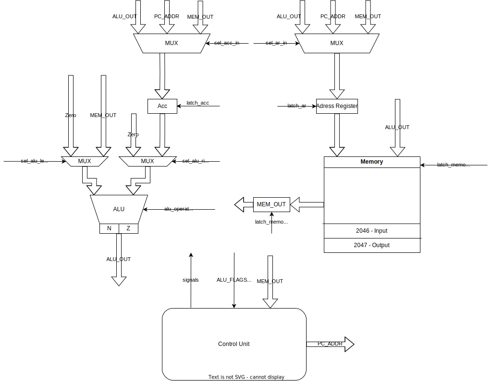

# csa-lab3

- Федоров Егор Владимирович. Группа P3215, ISU 367581
- `asm | acc | neum | hw | instr | struct | stream | mem | cstr | prob1`

## Синтаксис языка

```ebnf
program ::= line , [ "\n" , program ]

line ::= line_instruction | line_variable

line_variable ::= "VAR" , spacing , var_argument
var_argument ::= LABEL | number | ("'", word_of_letters_and_digits, "'")

line_instruction ::= [ label , ":" , spacing ] , instruction

label ::= word_of_letters_and_digits

instruction ::= instruction_name , spacing , instruction_arg

spacing ::= "\t" , " " , [ spacing ]

instruction_name ::=  | "LD"
                      | "ST"
                      | "ADD"
                      | "SUB"
                      | "MUL"
                      | "DIV"
                      | "MOD"
                      | "CMP"
                      | "JMP"
                      | "JZ"
                      | "HLT"

instruction_arg ::= 
    | (label | positive_number)
    | (addressation_direct_left, (label | number | literal), addressation_direct_right)
    | (addressation_indirect_left, (label | number | literal), addressation_indirect_right)

addressation_direct_left = "("
addressation_direct_right = ")"

addressation_indirect_left = "["
addressation_indirect_right = "]"

word_of_lettrs_and_digits := letter_or_digit , [ word_of_letters_and_digits ]
word_of_letters := letter , [ word_of_letters ]

number ::= [ "+" | "-" ] | positive_number
positive_number ::= digit , [ positive_number ]

literal ::= "'" , letter , "'"
letter_or_digit ::= letter | digit
lettter ::= "a-z" | "A-Z"
digit ::= "0" | "1" | "2" | "3" | "4" | "5" | "6" | "7" | "8" | "9"
```

## Семантика языка

Стратегия вычислений - последовательная. Метки имеют глобальную область видимости.
Переопределение меток недопустимо.
Поддерживается исключительно целочисленный тип.
При выводе / вводе значения преобразовываются в символьный тип по коду `UTF-8`.
Также поддерживаются литералы как аргументы инструкций. Тогда вместо них
будет использован их код `UTF-8`. В случае с псевдо-инструкцией
`VAR` поддерживаются литералы из нескольких символов.
В таком случае они будут преобразованы в набор литералов длины 1.
(`VAR 'hello' -> VAR 'h', VAR 'e', ..., VAR 'o', VAR 0`)

Выполнение инструкций начинается с инструкции, имеющей метку `START` или
с самой первой ячейки памяти, если метка `START` отсутствует.

## Организация памяти

Архитектура фон Неймана, память хранится в массиве длины 2048.
Индексация начинатся с 0.
Размер машинного слова неопределен.
Последние две ячейки памяти выделены под ввод и вывод соответственно.
| Memory  |
|----------|
| 0    |
| 1    |
| ...    |
| 2046 = Input    |
| 2047 = Output    |

## ISA

### Режимы адрессации

- Непосредственная (immediate) - операнд содержится в аргументе инструкции.
`operand = arg`.
На address fetch и operand fetch не нужны дополнительные такты.
Пример: `LD 42` загрузит в аккумулятор число 42.
`LD 'a'` загрузит в аккумулятор код символа `'a'`.

- Прямая (direct) - операнд содержится в памяти по аргуметну инструкции.
`operand = memory[arg]`.
На operand fetch необходим дополнительный такт.
Пример: `LD (HELLO)` загрузит в аккумулятор содержимое ячейки с меткой HELLO.
`LD (4)` загрузит в аккумулятор ячейку с индексом 4.

- Косвенная (indirect) - `operand = memory[memory[arg]]`.
Необходимо два дополнительных такта.

### Инструкции

#### LD

Загружает операнд в аккумулятор.
Не меняет значения флагов ALU.

Примеры

- `LD 42` загрузит в аккумулятор число 42.
- `LD 'a'` загрузит в аккумулятор код символа `a` (97)
- `LD (4)` загрузит в аккумулятор содержимое 4-й ячейки
- `LD HELLO` загрузит в аккумулятор номер инструкции с меткой HELLO
- `LD (HELLO)` загрузит в аккумулятор содержимое инструкции с меткой HELLO
- `LD [HELLO]` загрузит в аккумулятор ячейку, адрес которой лежит в ячейке
с меткой HELLO

#### ST

Сохраняет значение аккумулятора в ячейку с адресом операнда.

Примеры

- `ST 42` сохранит аккумулятор в ячейку с индексом 42.
- `ST HELLO` сохранит аккумулятор в ячейку с меткой HELLO.
- `ST (4)` сохранит аккумулятор в ячейку,
адрес которой лежит в ячейке с индексом 4
- `ST (HELLO)` сохранит аккумулятор в ячейку,
адрес которой лежит в ячейке с меткой HELLO

#### ADD

Добавляет к аккумулятору операнд и сохраняет в аккумулятор. Обновляет флаги.

#### SUB

Вычитает из аккумулятора операнд и сохраняет в аккумулятор. Обновляет флаги.

#### MUL

Умножает аккумулятор на операнд и сохраняет в аккумулятор. Обновляет флаги.

#### DIV

Целочисленно делит аккумулятор на операнд и сохраняет в аккумулятор.
Обновляет флаги.

#### MOD

Сохраняет в аккумулятор остаток от деления аккумулятора на операнд.

#### CMP

Выставляет флаги ALU по операции `аккумулятор - операнд`.
Не обновляет значение на выходе АЛУ.

#### JMP

Безусловный переход. Устанавливает PC на операнд.

#### JZ

Условный переход. Если установлен флаг `Z`,
то устанавливает значение PC на операнд, иначе - на PC + 1.

#### HLT

Останов

#### VAR

Псевдо-инструкция для выделения памяти.
Представляет из себя одну ячейку в памяти.

Примеры:

- `VAR 42` - ячейка памяти, содержащая число 42
- `VAR 'a'` - ячейка памяти, содержащая код символа `a` (97).
Транслятором также в конце будет добавлен null-термниатор, то есть
инструкция `VAR 'a'` будет преобразована в две инструкции `VAR 'a'` и `VAR 0`.

### Кодирование

Программа кодируется в JSON.
Итоговый json-файл содержит два ключа: `pc` и `instructions`.
`pc` содержит адрес, на который должен быть установлен program counter при
старте программы, `instructions` содержит массив инструкций, которые
должны быть загружены в память при запуске.
Инструкции будут загружены начиная с нулевой ячейки.

## Транслятор

Реализован в модуле [translator](./src/translator.py).
Интерфейс командной строки:

```bash
python3 src/translator.py <input_file> <target_file>
```

Этапы трансляции:

1. Расширение инструкций вида `LABEL: VAR 'hello'` в набор последовательных
инструкций вида `LABEL: VAR 'h', VAR 'e', ..., VAR 'o', VAR 0`.
2. Разбор меток
3. Парсинг инструкций и дальнейший перевод их в `json`

### Тестирование транслятора

Для транслятора на все его этапы написаны unit тесты в
файле [translator_test](./src/translator_test.py).
Также транслятор тестируется в golden тестах.

## Модель процессора

Реализовано в модуле [machine.py](./src/machine.py).

Интерфейс командной строки:

```bash
python3 machine.py <code_file> <input_file> <debug: true | false>
```

- Ключ `debug` отвечает за количество информации, показываемой в логах.
Если поставить его на `false`, то в логах будет только информация по окончании
каждой инструкции.
Если поставить его на `true`,
то в логах также будет информация о сигналах и тактах в процессоре.

### DataPath



Реализован в классе `DataPath`. АЛУ отдельно вынесен в класс `ALU` в модуле [alu](./src/alu.py).

#### Сигналы DataPath

- `latch_acc` - защелкивает в аккумуляторе выбранное значение
- `latch_ar` - защелкивает в adress register выбранное значение
- `latch_memory_write` - защелкивает в памяти по адресу `address register`
значение с выхода ALU
- `alu_operation` - выбор операции ALU.
Возможные опции: ADD, SUB, MUL, DIV, MOD, CMP

#### Флаги DataPath

- `Z` - наличие нуля на выходе ALU
- `N` - выход ALU < 0

#### Тестирование DataPath

Для DataPath также реализованы unit-тесты в файле [datapath_test](./src/datapath_test.py).
На данный момент в нем тестируются только операции чтения / записи в память.
Для ALU реализованы unit-тесты в файле [alu_test](./src/alu_test.py).
В них тестируется обработка операций и модификаторов АЛУ.

### Control Unit


Реализован в классе `ControlUnit`.
Метод `decode_and_execute` реализует цикл исполнения инструкции.
На нем:

- инструкция загружается в регистр `program` за 1 такт (метод `program_fetch`)
- адрес операнда загружается в `AR` за 0 или 1 такт (метод `address_fetch`)
- операнд загружается в регистр `MEM_OUT` за 0 или 1 такт
(метод `operand_fetch`)
- инструкция исполняется за 1 такт (метод `execute`).
Для разных типов инструкций (память, арифметика, контроль потока выполнения)
реализованы разные методы

#### Сигналы CU

- `latch_pc` - защелкивает значение `pc`
- `latch_program` - защелкивает текущую инструкцию

#### Тестирование CU

Control unit тестируется как golden тестами, так и дополнительно интеграционными
тестами в файле [integration_test](./src/integration_test.py) и unit-тестами в
файле [control_unit_test](./src/control_unit_test.py).
В интеграционных тестах тестируется работа control unit на программах
(например, вывод `hello world`), в unit тестах тестируется работа control unit
на разных этапах исполнения инструкций.

## Тестирование

### Разработанные тесты

- Golden тесты: [сами тесты](./src/golden), [golden_test](./src/golden_test.py).
Для всех тестов, кроме `prob1` включен debug режим
(отображение всего, что происходит в процессоре),
для теста `prob1` генерировался слишком большой yml файл (> 4 Мб),
было принято решение не заливать такое в git.
- Интеграционные тесты в файле [integration_test](./src/integration_test.py).
Отличаются от golden тестов тем, что

1) код вводится через массив строк
2) в некоторых тестах используется прямой доступ к памяти через `data_path.memory`.

- Unit-тесты. Реализованы unit-тесты для [control unit](#тестирование-cu),
[data path](#тестирование-DataPath) и
[транслятора](#тестирование-транслятора).

### CI

Был настроен CI для запуска всех тестов ([python.yml](./.github/workflows/python.yml)),
линтера ruff и проверки типов mypy.
Также был настроен линтер для Markdown ([markdown.yml](./.github/workflows/markdown.yml)).

### Реализованные алгоритмы

- `cat`. Реализован в [cat.asm](./examples/cat.asm),
golden тест: [cat.yml](./src/golden/cat.yml)
- `hello`. Реализован в [hello.asm](./examples/hello.asm),
golden тест: [hello.yml](./src/golden/hello.yml)
- `hello_username`. Реализован в [hello_name.asm](./examples/hello_username.asm),
golden тест: [hello_username](./src/golden/hello_name.yml)
- `prob1`. Реализован в [prob1.asm](./examples/prob1.asm),
golden тест: [prob1.yml](./examples/prob1.asm)

### Пример работы
Рассмотрим работу транслятора и процессора на примере алгоритма `cat`.

#### Трансляция
```bash
$ python3 src/translator.py examples/cat.asm compiled.json

Input file LoC: 6
Code instr: 6
```

#### Запуск
```bash
$ cat input.txt
Hello!

$ python3 src/machine.py compiled.json input.txt true
```

#### Журнал
```
DataPath        DEBUG   acc: 00000, ar: 0000, alu: 00000                                AR <- PC
DataPath        DEBUG   acc: 00000, ar: 0000, alu: 00000                                Reading memory on AR #0
DataPath        DEBUG   acc: 00000, ar: 0000, alu: 00000                                MEM_OUT <- MEM[0]
ControlUnit     DEBUG   PC: 0000, tick: 000001, instr: 00000, acc: 00000, ar: 0000      tick!
DataPath        DEBUG   acc: 00000, ar: 2046, alu: 00000                                AR <- MEM_OUT
DataPath        DEBUG   acc: 00000, ar: 2046, alu: 00000                                Reading memory on AR #2046
DataPath        INFO    acc: 00000, ar: 2046, alu: 00000                                Input: 'H' (72)
DataPath        DEBUG   acc: 00000, ar: 2046, alu: 00000                                MEM_OUT <- 'H' (72)
ControlUnit     DEBUG   PC: 0000, tick: 000002, instr: 00000, acc: 00000, ar: 2046      tick!
DataPath        DEBUG   acc: 00072, ar: 2046, alu: 00000                                ACC <- MEM_OUT
ControlUnit     DEBUG   PC: 0001, tick: 000002, instr: 00000, acc: 00072, ar: 2046      PC <- PC + 1
ControlUnit     DEBUG   PC: 0001, tick: 000003, instr: 00000, acc: 00072, ar: 2046      tick!
ControlUnit     INFO    PC: 0001, tick: 000003, instr: 00001, acc: 00072, ar: 2046      Executed instruction `ld (2046)` in 3 ticks
DataPath        DEBUG   acc: 00072, ar: 0001, alu: 00000                                AR <- PC
DataPath        DEBUG   acc: 00072, ar: 0001, alu: 00000                                Reading memory on AR #1
DataPath        DEBUG   acc: 00072, ar: 0001, alu: 00000                                MEM_OUT <- MEM[1]
ControlUnit     DEBUG   PC: 0001, tick: 000004, instr: 00001, acc: 00072, ar: 0001      tick!
DataPath        DEBUG   acc: 00072, ar: 2047, alu: 00000                                AR <- MEM_OUT
DataPath        DEBUG   acc: 00072, ar: 2047, alu: 00072                                Writing to memory on AR #2047
DataPath        INFO    acc: 00072, ar: 2047, alu: 00072                                Output: 'H' (72)
ControlUnit     DEBUG   PC: 0002, tick: 000004, instr: 00001, acc: 00072, ar: 2047      PC <- PC + 1
ControlUnit     DEBUG   PC: 0002, tick: 000005, instr: 00001, acc: 00072, ar: 2047      tick!
ControlUnit     INFO    PC: 0002, tick: 000005, instr: 00002, acc: 00072, ar: 2047      Executed instruction `st 2047` in 2 ticks
DataPath        DEBUG   acc: 00072, ar: 0002, alu: 00072                                AR <- PC
DataPath        DEBUG   acc: 00072, ar: 0002, alu: 00072                                Reading memory on AR #2
DataPath        DEBUG   acc: 00072, ar: 0002, alu: 00072                                MEM_OUT <- MEM[2]
ControlUnit     DEBUG   PC: 0002, tick: 000006, instr: 00002, acc: 00072, ar: 0002      tick!
ControlUnit     DEBUG   PC: 0003, tick: 000006, instr: 00002, acc: 00072, ar: 0002      PC <- PC + 1
ControlUnit     DEBUG   PC: 0003, tick: 000007, instr: 00002, acc: 00072, ar: 0002      tick!
ControlUnit     INFO    PC: 0003, tick: 000007, instr: 00003, acc: 00072, ar: 0002      Executed instruction `cmp 0` in 2 ticks
DataPath        DEBUG   acc: 00072, ar: 0003, alu: 00072                                AR <- PC
DataPath        DEBUG   acc: 00072, ar: 0003, alu: 00072                                Reading memory on AR #3
DataPath        DEBUG   acc: 00072, ar: 0003, alu: 00072                                MEM_OUT <- MEM[3]
ControlUnit     DEBUG   PC: 0003, tick: 000008, instr: 00003, acc: 00072, ar: 0003      tick!
ControlUnit     DEBUG   PC: 0004, tick: 000008, instr: 00003, acc: 00072, ar: 0003      PC <- PC + 1
ControlUnit     DEBUG   PC: 0004, tick: 000009, instr: 00003, acc: 00072, ar: 0003      tick!
ControlUnit     INFO    PC: 0004, tick: 000009, instr: 00004, acc: 00072, ar: 0003      Executed instruction `jz 5` in 2 ticks
DataPath        DEBUG   acc: 00072, ar: 0004, alu: 00072                                AR <- PC
DataPath        DEBUG   acc: 00072, ar: 0004, alu: 00072                                Reading memory on AR #4
DataPath        DEBUG   acc: 00072, ar: 0004, alu: 00072                                MEM_OUT <- MEM[4]
ControlUnit     DEBUG   PC: 0004, tick: 000010, instr: 00004, acc: 00072, ar: 0004      tick!
ControlUnit     DEBUG   PC: 0000, tick: 000010, instr: 00004, acc: 00072, ar: 0004      PC <- MEM_OUT
ControlUnit     DEBUG   PC: 0000, tick: 000011, instr: 00004, acc: 00072, ar: 0004      tick!
ControlUnit     INFO    PC: 0000, tick: 000011, instr: 00005, acc: 00072, ar: 0004      Executed instruction `jmp 0` in 2 ticks
DataPath        DEBUG   acc: 00072, ar: 0000, alu: 00072                                AR <- PC
DataPath        DEBUG   acc: 00072, ar: 0000, alu: 00072                                Reading memory on AR #0
DataPath        DEBUG   acc: 00072, ar: 0000, alu: 00072                                MEM_OUT <- MEM[0]
ControlUnit     DEBUG   PC: 0000, tick: 000012, instr: 00005, acc: 00072, ar: 0000      tick!
DataPath        DEBUG   acc: 00072, ar: 2046, alu: 00072                                AR <- MEM_OUT
DataPath        DEBUG   acc: 00072, ar: 2046, alu: 00072                                Reading memory on AR #2046
DataPath        INFO    acc: 00072, ar: 2046, alu: 00072                                Input: 'e' (101)
DataPath        DEBUG   acc: 00072, ar: 2046, alu: 00072                                MEM_OUT <- 'e' (101)
ControlUnit     DEBUG   PC: 0000, tick: 000013, instr: 00005, acc: 00072, ar: 2046      tick!
DataPath        DEBUG   acc: 00101, ar: 2046, alu: 00072                                ACC <- MEM_OUT
ControlUnit     DEBUG   PC: 0001, tick: 000013, instr: 00005, acc: 00101, ar: 2046      PC <- PC + 1
ControlUnit     DEBUG   PC: 0001, tick: 000014, instr: 00005, acc: 00101, ar: 2046      tick!
ControlUnit     INFO    PC: 0001, tick: 000014, instr: 00006, acc: 00101, ar: 2046      Executed instruction `ld (2046)` in 3 ticks
DataPath        DEBUG   acc: 00101, ar: 0001, alu: 00072                                AR <- PC
DataPath        DEBUG   acc: 00101, ar: 0001, alu: 00072                                Reading memory on AR #1
DataPath        DEBUG   acc: 00101, ar: 0001, alu: 00072                                MEM_OUT <- MEM[1]
ControlUnit     DEBUG   PC: 0001, tick: 000015, instr: 00006, acc: 00101, ar: 0001      tick!
DataPath        DEBUG   acc: 00101, ar: 2047, alu: 00072                                AR <- MEM_OUT
DataPath        DEBUG   acc: 00101, ar: 2047, alu: 00101                                Writing to memory on AR #2047
DataPath        INFO    acc: 00101, ar: 2047, alu: 00101                                Output: 'e' (101)
ControlUnit     DEBUG   PC: 0002, tick: 000015, instr: 00006, acc: 00101, ar: 2047      PC <- PC + 1
ControlUnit     DEBUG   PC: 0002, tick: 000016, instr: 00006, acc: 00101, ar: 2047      tick!
ControlUnit     INFO    PC: 0002, tick: 000016, instr: 00007, acc: 00101, ar: 2047      Executed instruction `st 2047` in 2 ticks
DataPath        DEBUG   acc: 00101, ar: 0002, alu: 00101                                AR <- PC
DataPath        DEBUG   acc: 00101, ar: 0002, alu: 00101                                Reading memory on AR #2
DataPath        DEBUG   acc: 00101, ar: 0002, alu: 00101                                MEM_OUT <- MEM[2]
ControlUnit     DEBUG   PC: 0002, tick: 000017, instr: 00007, acc: 00101, ar: 0002      tick!
ControlUnit     DEBUG   PC: 0003, tick: 000017, instr: 00007, acc: 00101, ar: 0002      PC <- PC + 1
ControlUnit     DEBUG   PC: 0003, tick: 000018, instr: 00007, acc: 00101, ar: 0002      tick!
ControlUnit     INFO    PC: 0003, tick: 000018, instr: 00008, acc: 00101, ar: 0002      Executed instruction `cmp 0` in 2 ticks
DataPath        DEBUG   acc: 00101, ar: 0003, alu: 00101                                AR <- PC
DataPath        DEBUG   acc: 00101, ar: 0003, alu: 00101                                Reading memory on AR #3
DataPath        DEBUG   acc: 00101, ar: 0003, alu: 00101                                MEM_OUT <- MEM[3]
ControlUnit     DEBUG   PC: 0003, tick: 000019, instr: 00008, acc: 00101, ar: 0003      tick!
ControlUnit     DEBUG   PC: 0004, tick: 000019, instr: 00008, acc: 00101, ar: 0003      PC <- PC + 1
ControlUnit     DEBUG   PC: 0004, tick: 000020, instr: 00008, acc: 00101, ar: 0003      tick!
ControlUnit     INFO    PC: 0004, tick: 000020, instr: 00009, acc: 00101, ar: 0003      Executed instruction `jz 5` in 2 ticks
DataPath        DEBUG   acc: 00101, ar: 0004, alu: 00101                                AR <- PC
DataPath        DEBUG   acc: 00101, ar: 0004, alu: 00101                                Reading memory on AR #4
DataPath        DEBUG   acc: 00101, ar: 0004, alu: 00101                                MEM_OUT <- MEM[4]
ControlUnit     DEBUG   PC: 0004, tick: 000021, instr: 00009, acc: 00101, ar: 0004      tick!
ControlUnit     DEBUG   PC: 0000, tick: 000021, instr: 00009, acc: 00101, ar: 0004      PC <- MEM_OUT
ControlUnit     DEBUG   PC: 0000, tick: 000022, instr: 00009, acc: 00101, ar: 0004      tick!
ControlUnit     INFO    PC: 0000, tick: 000022, instr: 00010, acc: 00101, ar: 0004      Executed instruction `jmp 0` in 2 ticks
DataPath        DEBUG   acc: 00101, ar: 0000, alu: 00101                                AR <- PC
DataPath        DEBUG   acc: 00101, ar: 0000, alu: 00101                                Reading memory on AR #0
DataPath        DEBUG   acc: 00101, ar: 0000, alu: 00101                                MEM_OUT <- MEM[0]
ControlUnit     DEBUG   PC: 0000, tick: 000023, instr: 00010, acc: 00101, ar: 0000      tick!
DataPath        DEBUG   acc: 00101, ar: 2046, alu: 00101                                AR <- MEM_OUT
DataPath        DEBUG   acc: 00101, ar: 2046, alu: 00101                                Reading memory on AR #2046
DataPath        INFO    acc: 00101, ar: 2046, alu: 00101                                Input: 'l' (108)
DataPath        DEBUG   acc: 00101, ar: 2046, alu: 00101                                MEM_OUT <- 'l' (108)
ControlUnit     DEBUG   PC: 0000, tick: 000024, instr: 00010, acc: 00101, ar: 2046      tick!
DataPath        DEBUG   acc: 00108, ar: 2046, alu: 00101                                ACC <- MEM_OUT
ControlUnit     DEBUG   PC: 0001, tick: 000024, instr: 00010, acc: 00108, ar: 2046      PC <- PC + 1
ControlUnit     DEBUG   PC: 0001, tick: 000025, instr: 00010, acc: 00108, ar: 2046      tick!
ControlUnit     INFO    PC: 0001, tick: 000025, instr: 00011, acc: 00108, ar: 2046      Executed instruction `ld (2046)` in 3 ticks
DataPath        DEBUG   acc: 00108, ar: 0001, alu: 00101                                AR <- PC
DataPath        DEBUG   acc: 00108, ar: 0001, alu: 00101                                Reading memory on AR #1
DataPath        DEBUG   acc: 00108, ar: 0001, alu: 00101                                MEM_OUT <- MEM[1]
ControlUnit     DEBUG   PC: 0001, tick: 000026, instr: 00011, acc: 00108, ar: 0001      tick!
DataPath        DEBUG   acc: 00108, ar: 2047, alu: 00101                                AR <- MEM_OUT
DataPath        DEBUG   acc: 00108, ar: 2047, alu: 00108                                Writing to memory on AR #2047
DataPath        INFO    acc: 00108, ar: 2047, alu: 00108                                Output: 'l' (108)
ControlUnit     DEBUG   PC: 0002, tick: 000026, instr: 00011, acc: 00108, ar: 2047      PC <- PC + 1
ControlUnit     DEBUG   PC: 0002, tick: 000027, instr: 00011, acc: 00108, ar: 2047      tick!
ControlUnit     INFO    PC: 0002, tick: 000027, instr: 00012, acc: 00108, ar: 2047      Executed instruction `st 2047` in 2 ticks
DataPath        DEBUG   acc: 00108, ar: 0002, alu: 00108                                AR <- PC
DataPath        DEBUG   acc: 00108, ar: 0002, alu: 00108                                Reading memory on AR #2
DataPath        DEBUG   acc: 00108, ar: 0002, alu: 00108                                MEM_OUT <- MEM[2]
ControlUnit     DEBUG   PC: 0002, tick: 000028, instr: 00012, acc: 00108, ar: 0002      tick!
ControlUnit     DEBUG   PC: 0003, tick: 000028, instr: 00012, acc: 00108, ar: 0002      PC <- PC + 1
ControlUnit     DEBUG   PC: 0003, tick: 000029, instr: 00012, acc: 00108, ar: 0002      tick!
ControlUnit     INFO    PC: 0003, tick: 000029, instr: 00013, acc: 00108, ar: 0002      Executed instruction `cmp 0` in 2 ticks
DataPath        DEBUG   acc: 00108, ar: 0003, alu: 00108                                AR <- PC
DataPath        DEBUG   acc: 00108, ar: 0003, alu: 00108                                Reading memory on AR #3
DataPath        DEBUG   acc: 00108, ar: 0003, alu: 00108                                MEM_OUT <- MEM[3]
ControlUnit     DEBUG   PC: 0003, tick: 000030, instr: 00013, acc: 00108, ar: 0003      tick!
ControlUnit     DEBUG   PC: 0004, tick: 000030, instr: 00013, acc: 00108, ar: 0003      PC <- PC + 1
ControlUnit     DEBUG   PC: 0004, tick: 000031, instr: 00013, acc: 00108, ar: 0003      tick!
ControlUnit     INFO    PC: 0004, tick: 000031, instr: 00014, acc: 00108, ar: 0003      Executed instruction `jz 5` in 2 ticks
DataPath        DEBUG   acc: 00108, ar: 0004, alu: 00108                                AR <- PC
DataPath        DEBUG   acc: 00108, ar: 0004, alu: 00108                                Reading memory on AR #4
DataPath        DEBUG   acc: 00108, ar: 0004, alu: 00108                                MEM_OUT <- MEM[4]
ControlUnit     DEBUG   PC: 0004, tick: 000032, instr: 00014, acc: 00108, ar: 0004      tick!
ControlUnit     DEBUG   PC: 0000, tick: 000032, instr: 00014, acc: 00108, ar: 0004      PC <- MEM_OUT
ControlUnit     DEBUG   PC: 0000, tick: 000033, instr: 00014, acc: 00108, ar: 0004      tick!
ControlUnit     INFO    PC: 0000, tick: 000033, instr: 00015, acc: 00108, ar: 0004      Executed instruction `jmp 0` in 2 ticks
DataPath        DEBUG   acc: 00108, ar: 0000, alu: 00108                                AR <- PC
DataPath        DEBUG   acc: 00108, ar: 0000, alu: 00108                                Reading memory on AR #0
DataPath        DEBUG   acc: 00108, ar: 0000, alu: 00108                                MEM_OUT <- MEM[0]
ControlUnit     DEBUG   PC: 0000, tick: 000034, instr: 00015, acc: 00108, ar: 0000      tick!
DataPath        DEBUG   acc: 00108, ar: 2046, alu: 00108                                AR <- MEM_OUT
DataPath        DEBUG   acc: 00108, ar: 2046, alu: 00108                                Reading memory on AR #2046
DataPath        INFO    acc: 00108, ar: 2046, alu: 00108                                Input: 'l' (108)
DataPath        DEBUG   acc: 00108, ar: 2046, alu: 00108                                MEM_OUT <- 'l' (108)
ControlUnit     DEBUG   PC: 0000, tick: 000035, instr: 00015, acc: 00108, ar: 2046      tick!
DataPath        DEBUG   acc: 00108, ar: 2046, alu: 00108                                ACC <- MEM_OUT
ControlUnit     DEBUG   PC: 0001, tick: 000035, instr: 00015, acc: 00108, ar: 2046      PC <- PC + 1
ControlUnit     DEBUG   PC: 0001, tick: 000036, instr: 00015, acc: 00108, ar: 2046      tick!
ControlUnit     INFO    PC: 0001, tick: 000036, instr: 00016, acc: 00108, ar: 2046      Executed instruction `ld (2046)` in 3 ticks
DataPath        DEBUG   acc: 00108, ar: 0001, alu: 00108                                AR <- PC
DataPath        DEBUG   acc: 00108, ar: 0001, alu: 00108                                Reading memory on AR #1
DataPath        DEBUG   acc: 00108, ar: 0001, alu: 00108                                MEM_OUT <- MEM[1]
ControlUnit     DEBUG   PC: 0001, tick: 000037, instr: 00016, acc: 00108, ar: 0001      tick!
DataPath        DEBUG   acc: 00108, ar: 2047, alu: 00108                                AR <- MEM_OUT
DataPath        DEBUG   acc: 00108, ar: 2047, alu: 00108                                Writing to memory on AR #2047
DataPath        INFO    acc: 00108, ar: 2047, alu: 00108                                Output: 'l' (108)
ControlUnit     DEBUG   PC: 0002, tick: 000037, instr: 00016, acc: 00108, ar: 2047      PC <- PC + 1
ControlUnit     DEBUG   PC: 0002, tick: 000038, instr: 00016, acc: 00108, ar: 2047      tick!
ControlUnit     INFO    PC: 0002, tick: 000038, instr: 00017, acc: 00108, ar: 2047      Executed instruction `st 2047` in 2 ticks
DataPath        DEBUG   acc: 00108, ar: 0002, alu: 00108                                AR <- PC
DataPath        DEBUG   acc: 00108, ar: 0002, alu: 00108                                Reading memory on AR #2
DataPath        DEBUG   acc: 00108, ar: 0002, alu: 00108                                MEM_OUT <- MEM[2]
ControlUnit     DEBUG   PC: 0002, tick: 000039, instr: 00017, acc: 00108, ar: 0002      tick!
ControlUnit     DEBUG   PC: 0003, tick: 000039, instr: 00017, acc: 00108, ar: 0002      PC <- PC + 1
ControlUnit     DEBUG   PC: 0003, tick: 000040, instr: 00017, acc: 00108, ar: 0002      tick!
ControlUnit     INFO    PC: 0003, tick: 000040, instr: 00018, acc: 00108, ar: 0002      Executed instruction `cmp 0` in 2 ticks
DataPath        DEBUG   acc: 00108, ar: 0003, alu: 00108                                AR <- PC
DataPath        DEBUG   acc: 00108, ar: 0003, alu: 00108                                Reading memory on AR #3
DataPath        DEBUG   acc: 00108, ar: 0003, alu: 00108                                MEM_OUT <- MEM[3]
ControlUnit     DEBUG   PC: 0003, tick: 000041, instr: 00018, acc: 00108, ar: 0003      tick!
ControlUnit     DEBUG   PC: 0004, tick: 000041, instr: 00018, acc: 00108, ar: 0003      PC <- PC + 1
ControlUnit     DEBUG   PC: 0004, tick: 000042, instr: 00018, acc: 00108, ar: 0003      tick!
ControlUnit     INFO    PC: 0004, tick: 000042, instr: 00019, acc: 00108, ar: 0003      Executed instruction `jz 5` in 2 ticks
DataPath        DEBUG   acc: 00108, ar: 0004, alu: 00108                                AR <- PC
DataPath        DEBUG   acc: 00108, ar: 0004, alu: 00108                                Reading memory on AR #4
DataPath        DEBUG   acc: 00108, ar: 0004, alu: 00108                                MEM_OUT <- MEM[4]
ControlUnit     DEBUG   PC: 0004, tick: 000043, instr: 00019, acc: 00108, ar: 0004      tick!
ControlUnit     DEBUG   PC: 0000, tick: 000043, instr: 00019, acc: 00108, ar: 0004      PC <- MEM_OUT
ControlUnit     DEBUG   PC: 0000, tick: 000044, instr: 00019, acc: 00108, ar: 0004      tick!
ControlUnit     INFO    PC: 0000, tick: 000044, instr: 00020, acc: 00108, ar: 0004      Executed instruction `jmp 0` in 2 ticks
DataPath        DEBUG   acc: 00108, ar: 0000, alu: 00108                                AR <- PC
DataPath        DEBUG   acc: 00108, ar: 0000, alu: 00108                                Reading memory on AR #0
DataPath        DEBUG   acc: 00108, ar: 0000, alu: 00108                                MEM_OUT <- MEM[0]
ControlUnit     DEBUG   PC: 0000, tick: 000045, instr: 00020, acc: 00108, ar: 0000      tick!
DataPath        DEBUG   acc: 00108, ar: 2046, alu: 00108                                AR <- MEM_OUT
DataPath        DEBUG   acc: 00108, ar: 2046, alu: 00108                                Reading memory on AR #2046
DataPath        INFO    acc: 00108, ar: 2046, alu: 00108                                Input: 'o' (111)
DataPath        DEBUG   acc: 00108, ar: 2046, alu: 00108                                MEM_OUT <- 'o' (111)
ControlUnit     DEBUG   PC: 0000, tick: 000046, instr: 00020, acc: 00108, ar: 2046      tick!
DataPath        DEBUG   acc: 00111, ar: 2046, alu: 00108                                ACC <- MEM_OUT
ControlUnit     DEBUG   PC: 0001, tick: 000046, instr: 00020, acc: 00111, ar: 2046      PC <- PC + 1
ControlUnit     DEBUG   PC: 0001, tick: 000047, instr: 00020, acc: 00111, ar: 2046      tick!
ControlUnit     INFO    PC: 0001, tick: 000047, instr: 00021, acc: 00111, ar: 2046      Executed instruction `ld (2046)` in 3 ticks
DataPath        DEBUG   acc: 00111, ar: 0001, alu: 00108                                AR <- PC
DataPath        DEBUG   acc: 00111, ar: 0001, alu: 00108                                Reading memory on AR #1
DataPath        DEBUG   acc: 00111, ar: 0001, alu: 00108                                MEM_OUT <- MEM[1]
ControlUnit     DEBUG   PC: 0001, tick: 000048, instr: 00021, acc: 00111, ar: 0001      tick!
DataPath        DEBUG   acc: 00111, ar: 2047, alu: 00108                                AR <- MEM_OUT
DataPath        DEBUG   acc: 00111, ar: 2047, alu: 00111                                Writing to memory on AR #2047
DataPath        INFO    acc: 00111, ar: 2047, alu: 00111                                Output: 'o' (111)
ControlUnit     DEBUG   PC: 0002, tick: 000048, instr: 00021, acc: 00111, ar: 2047      PC <- PC + 1
ControlUnit     DEBUG   PC: 0002, tick: 000049, instr: 00021, acc: 00111, ar: 2047      tick!
ControlUnit     INFO    PC: 0002, tick: 000049, instr: 00022, acc: 00111, ar: 2047      Executed instruction `st 2047` in 2 ticks
DataPath        DEBUG   acc: 00111, ar: 0002, alu: 00111                                AR <- PC
DataPath        DEBUG   acc: 00111, ar: 0002, alu: 00111                                Reading memory on AR #2
DataPath        DEBUG   acc: 00111, ar: 0002, alu: 00111                                MEM_OUT <- MEM[2]
ControlUnit     DEBUG   PC: 0002, tick: 000050, instr: 00022, acc: 00111, ar: 0002      tick!
ControlUnit     DEBUG   PC: 0003, tick: 000050, instr: 00022, acc: 00111, ar: 0002      PC <- PC + 1
ControlUnit     DEBUG   PC: 0003, tick: 000051, instr: 00022, acc: 00111, ar: 0002      tick!
ControlUnit     INFO    PC: 0003, tick: 000051, instr: 00023, acc: 00111, ar: 0002      Executed instruction `cmp 0` in 2 ticks
DataPath        DEBUG   acc: 00111, ar: 0003, alu: 00111                                AR <- PC
DataPath        DEBUG   acc: 00111, ar: 0003, alu: 00111                                Reading memory on AR #3
DataPath        DEBUG   acc: 00111, ar: 0003, alu: 00111                                MEM_OUT <- MEM[3]
ControlUnit     DEBUG   PC: 0003, tick: 000052, instr: 00023, acc: 00111, ar: 0003      tick!
ControlUnit     DEBUG   PC: 0004, tick: 000052, instr: 00023, acc: 00111, ar: 0003      PC <- PC + 1
ControlUnit     DEBUG   PC: 0004, tick: 000053, instr: 00023, acc: 00111, ar: 0003      tick!
ControlUnit     INFO    PC: 0004, tick: 000053, instr: 00024, acc: 00111, ar: 0003      Executed instruction `jz 5` in 2 ticks
DataPath        DEBUG   acc: 00111, ar: 0004, alu: 00111                                AR <- PC
DataPath        DEBUG   acc: 00111, ar: 0004, alu: 00111                                Reading memory on AR #4
DataPath        DEBUG   acc: 00111, ar: 0004, alu: 00111                                MEM_OUT <- MEM[4]
ControlUnit     DEBUG   PC: 0004, tick: 000054, instr: 00024, acc: 00111, ar: 0004      tick!
ControlUnit     DEBUG   PC: 0000, tick: 000054, instr: 00024, acc: 00111, ar: 0004      PC <- MEM_OUT
ControlUnit     DEBUG   PC: 0000, tick: 000055, instr: 00024, acc: 00111, ar: 0004      tick!
ControlUnit     INFO    PC: 0000, tick: 000055, instr: 00025, acc: 00111, ar: 0004      Executed instruction `jmp 0` in 2 ticks
DataPath        DEBUG   acc: 00111, ar: 0000, alu: 00111                                AR <- PC
DataPath        DEBUG   acc: 00111, ar: 0000, alu: 00111                                Reading memory on AR #0
DataPath        DEBUG   acc: 00111, ar: 0000, alu: 00111                                MEM_OUT <- MEM[0]
ControlUnit     DEBUG   PC: 0000, tick: 000056, instr: 00025, acc: 00111, ar: 0000      tick!
DataPath        DEBUG   acc: 00111, ar: 2046, alu: 00111                                AR <- MEM_OUT
DataPath        DEBUG   acc: 00111, ar: 2046, alu: 00111                                Reading memory on AR #2046
DataPath        INFO    acc: 00111, ar: 2046, alu: 00111                                Input: '!' (33)
DataPath        DEBUG   acc: 00111, ar: 2046, alu: 00111                                MEM_OUT <- '!' (33)
ControlUnit     DEBUG   PC: 0000, tick: 000057, instr: 00025, acc: 00111, ar: 2046      tick!
DataPath        DEBUG   acc: 00033, ar: 2046, alu: 00111                                ACC <- MEM_OUT
ControlUnit     DEBUG   PC: 0001, tick: 000057, instr: 00025, acc: 00033, ar: 2046      PC <- PC + 1
ControlUnit     DEBUG   PC: 0001, tick: 000058, instr: 00025, acc: 00033, ar: 2046      tick!
ControlUnit     INFO    PC: 0001, tick: 000058, instr: 00026, acc: 00033, ar: 2046      Executed instruction `ld (2046)` in 3 ticks
DataPath        DEBUG   acc: 00033, ar: 0001, alu: 00111                                AR <- PC
DataPath        DEBUG   acc: 00033, ar: 0001, alu: 00111                                Reading memory on AR #1
DataPath        DEBUG   acc: 00033, ar: 0001, alu: 00111                                MEM_OUT <- MEM[1]
ControlUnit     DEBUG   PC: 0001, tick: 000059, instr: 00026, acc: 00033, ar: 0001      tick!
DataPath        DEBUG   acc: 00033, ar: 2047, alu: 00111                                AR <- MEM_OUT
DataPath        DEBUG   acc: 00033, ar: 2047, alu: 00033                                Writing to memory on AR #2047
DataPath        INFO    acc: 00033, ar: 2047, alu: 00033                                Output: '!' (33)
ControlUnit     DEBUG   PC: 0002, tick: 000059, instr: 00026, acc: 00033, ar: 2047      PC <- PC + 1
ControlUnit     DEBUG   PC: 0002, tick: 000060, instr: 00026, acc: 00033, ar: 2047      tick!
ControlUnit     INFO    PC: 0002, tick: 000060, instr: 00027, acc: 00033, ar: 2047      Executed instruction `st 2047` in 2 ticks
DataPath        DEBUG   acc: 00033, ar: 0002, alu: 00033                                AR <- PC
DataPath        DEBUG   acc: 00033, ar: 0002, alu: 00033                                Reading memory on AR #2
DataPath        DEBUG   acc: 00033, ar: 0002, alu: 00033                                MEM_OUT <- MEM[2]
ControlUnit     DEBUG   PC: 0002, tick: 000061, instr: 00027, acc: 00033, ar: 0002      tick!
ControlUnit     DEBUG   PC: 0003, tick: 000061, instr: 00027, acc: 00033, ar: 0002      PC <- PC + 1
ControlUnit     DEBUG   PC: 0003, tick: 000062, instr: 00027, acc: 00033, ar: 0002      tick!
ControlUnit     INFO    PC: 0003, tick: 000062, instr: 00028, acc: 00033, ar: 0002      Executed instruction `cmp 0` in 2 ticks
DataPath        DEBUG   acc: 00033, ar: 0003, alu: 00033                                AR <- PC
DataPath        DEBUG   acc: 00033, ar: 0003, alu: 00033                                Reading memory on AR #3
DataPath        DEBUG   acc: 00033, ar: 0003, alu: 00033                                MEM_OUT <- MEM[3]
ControlUnit     DEBUG   PC: 0003, tick: 000063, instr: 00028, acc: 00033, ar: 0003      tick!
ControlUnit     DEBUG   PC: 0004, tick: 000063, instr: 00028, acc: 00033, ar: 0003      PC <- PC + 1
ControlUnit     DEBUG   PC: 0004, tick: 000064, instr: 00028, acc: 00033, ar: 0003      tick!
ControlUnit     INFO    PC: 0004, tick: 000064, instr: 00029, acc: 00033, ar: 0003      Executed instruction `jz 5` in 2 ticks
DataPath        DEBUG   acc: 00033, ar: 0004, alu: 00033                                AR <- PC
DataPath        DEBUG   acc: 00033, ar: 0004, alu: 00033                                Reading memory on AR #4
DataPath        DEBUG   acc: 00033, ar: 0004, alu: 00033                                MEM_OUT <- MEM[4]
ControlUnit     DEBUG   PC: 0004, tick: 000065, instr: 00029, acc: 00033, ar: 0004      tick!
ControlUnit     DEBUG   PC: 0000, tick: 000065, instr: 00029, acc: 00033, ar: 0004      PC <- MEM_OUT
ControlUnit     DEBUG   PC: 0000, tick: 000066, instr: 00029, acc: 00033, ar: 0004      tick!
ControlUnit     INFO    PC: 0000, tick: 000066, instr: 00030, acc: 00033, ar: 0004      Executed instruction `jmp 0` in 2 ticks
DataPath        DEBUG   acc: 00033, ar: 0000, alu: 00033                                AR <- PC
DataPath        DEBUG   acc: 00033, ar: 0000, alu: 00033                                Reading memory on AR #0
DataPath        DEBUG   acc: 00033, ar: 0000, alu: 00033                                MEM_OUT <- MEM[0]
ControlUnit     DEBUG   PC: 0000, tick: 000067, instr: 00030, acc: 00033, ar: 0000      tick!
DataPath        DEBUG   acc: 00033, ar: 2046, alu: 00033                                AR <- MEM_OUT
DataPath        DEBUG   acc: 00033, ar: 2046, alu: 00033                                Reading memory on AR #2046
DataPath        INFO    acc: 00033, ar: 2046, alu: 00033                                Input: '\n' (10)
DataPath        DEBUG   acc: 00033, ar: 2046, alu: 00033                                MEM_OUT <- '\n' (10)
ControlUnit     DEBUG   PC: 0000, tick: 000068, instr: 00030, acc: 00033, ar: 2046      tick!
DataPath        DEBUG   acc: 00010, ar: 2046, alu: 00033                                ACC <- MEM_OUT
ControlUnit     DEBUG   PC: 0001, tick: 000068, instr: 00030, acc: 00010, ar: 2046      PC <- PC + 1
ControlUnit     DEBUG   PC: 0001, tick: 000069, instr: 00030, acc: 00010, ar: 2046      tick!
ControlUnit     INFO    PC: 0001, tick: 000069, instr: 00031, acc: 00010, ar: 2046      Executed instruction `ld (2046)` in 3 ticks
DataPath        DEBUG   acc: 00010, ar: 0001, alu: 00033                                AR <- PC
DataPath        DEBUG   acc: 00010, ar: 0001, alu: 00033                                Reading memory on AR #1
DataPath        DEBUG   acc: 00010, ar: 0001, alu: 00033                                MEM_OUT <- MEM[1]
ControlUnit     DEBUG   PC: 0001, tick: 000070, instr: 00031, acc: 00010, ar: 0001      tick!
DataPath        DEBUG   acc: 00010, ar: 2047, alu: 00033                                AR <- MEM_OUT
DataPath        DEBUG   acc: 00010, ar: 2047, alu: 00010                                Writing to memory on AR #2047
DataPath        INFO    acc: 00010, ar: 2047, alu: 00010                                Output: '\n' (10)
ControlUnit     DEBUG   PC: 0002, tick: 000070, instr: 00031, acc: 00010, ar: 2047      PC <- PC + 1
ControlUnit     DEBUG   PC: 0002, tick: 000071, instr: 00031, acc: 00010, ar: 2047      tick!
ControlUnit     INFO    PC: 0002, tick: 000071, instr: 00032, acc: 00010, ar: 2047      Executed instruction `st 2047` in 2 ticks
DataPath        DEBUG   acc: 00010, ar: 0002, alu: 00010                                AR <- PC
DataPath        DEBUG   acc: 00010, ar: 0002, alu: 00010                                Reading memory on AR #2
DataPath        DEBUG   acc: 00010, ar: 0002, alu: 00010                                MEM_OUT <- MEM[2]
ControlUnit     DEBUG   PC: 0002, tick: 000072, instr: 00032, acc: 00010, ar: 0002      tick!
ControlUnit     DEBUG   PC: 0003, tick: 000072, instr: 00032, acc: 00010, ar: 0002      PC <- PC + 1
ControlUnit     DEBUG   PC: 0003, tick: 000073, instr: 00032, acc: 00010, ar: 0002      tick!
ControlUnit     INFO    PC: 0003, tick: 000073, instr: 00033, acc: 00010, ar: 0002      Executed instruction `cmp 0` in 2 ticks
DataPath        DEBUG   acc: 00010, ar: 0003, alu: 00010                                AR <- PC
DataPath        DEBUG   acc: 00010, ar: 0003, alu: 00010                                Reading memory on AR #3
DataPath        DEBUG   acc: 00010, ar: 0003, alu: 00010                                MEM_OUT <- MEM[3]
ControlUnit     DEBUG   PC: 0003, tick: 000074, instr: 00033, acc: 00010, ar: 0003      tick!
ControlUnit     DEBUG   PC: 0004, tick: 000074, instr: 00033, acc: 00010, ar: 0003      PC <- PC + 1
ControlUnit     DEBUG   PC: 0004, tick: 000075, instr: 00033, acc: 00010, ar: 0003      tick!
ControlUnit     INFO    PC: 0004, tick: 000075, instr: 00034, acc: 00010, ar: 0003      Executed instruction `jz 5` in 2 ticks
DataPath        DEBUG   acc: 00010, ar: 0004, alu: 00010                                AR <- PC
DataPath        DEBUG   acc: 00010, ar: 0004, alu: 00010                                Reading memory on AR #4
DataPath        DEBUG   acc: 00010, ar: 0004, alu: 00010                                MEM_OUT <- MEM[4]
ControlUnit     DEBUG   PC: 0004, tick: 000076, instr: 00034, acc: 00010, ar: 0004      tick!
ControlUnit     DEBUG   PC: 0000, tick: 000076, instr: 00034, acc: 00010, ar: 0004      PC <- MEM_OUT
ControlUnit     DEBUG   PC: 0000, tick: 000077, instr: 00034, acc: 00010, ar: 0004      tick!
ControlUnit     INFO    PC: 0000, tick: 000077, instr: 00035, acc: 00010, ar: 0004      Executed instruction `jmp 0` in 2 ticks
DataPath        DEBUG   acc: 00010, ar: 0000, alu: 00010                                AR <- PC
DataPath        DEBUG   acc: 00010, ar: 0000, alu: 00010                                Reading memory on AR #0
DataPath        DEBUG   acc: 00010, ar: 0000, alu: 00010                                MEM_OUT <- MEM[0]
ControlUnit     DEBUG   PC: 0000, tick: 000078, instr: 00035, acc: 00010, ar: 0000      tick!
DataPath        DEBUG   acc: 00010, ar: 2046, alu: 00010                                AR <- MEM_OUT
DataPath        DEBUG   acc: 00010, ar: 2046, alu: 00010                                Reading memory on AR #2046
DataPath        INFO    acc: 00010, ar: 2046, alu: 00010                                Input: '\x00' (0)
DataPath        DEBUG   acc: 00010, ar: 2046, alu: 00010                                MEM_OUT <- '\x00' (0)
ControlUnit     DEBUG   PC: 0000, tick: 000079, instr: 00035, acc: 00010, ar: 2046      tick!
DataPath        DEBUG   acc: 00000, ar: 2046, alu: 00010                                ACC <- MEM_OUT
ControlUnit     DEBUG   PC: 0001, tick: 000079, instr: 00035, acc: 00000, ar: 2046      PC <- PC + 1
ControlUnit     DEBUG   PC: 0001, tick: 000080, instr: 00035, acc: 00000, ar: 2046      tick!
ControlUnit     INFO    PC: 0001, tick: 000080, instr: 00036, acc: 00000, ar: 2046      Executed instruction `ld (2046)` in 3 ticks
DataPath        DEBUG   acc: 00000, ar: 0001, alu: 00010                                AR <- PC
DataPath        DEBUG   acc: 00000, ar: 0001, alu: 00010                                Reading memory on AR #1
DataPath        DEBUG   acc: 00000, ar: 0001, alu: 00010                                MEM_OUT <- MEM[1]
ControlUnit     DEBUG   PC: 0001, tick: 000081, instr: 00036, acc: 00000, ar: 0001      tick!
DataPath        DEBUG   acc: 00000, ar: 2047, alu: 00010                                AR <- MEM_OUT
DataPath        DEBUG   acc: 00000, ar: 2047, alu: 00000                                Writing to memory on AR #2047
DataPath        INFO    acc: 00000, ar: 2047, alu: 00000                                Output: '\x00' (0)
ControlUnit     DEBUG   PC: 0002, tick: 000081, instr: 00036, acc: 00000, ar: 2047      PC <- PC + 1
ControlUnit     DEBUG   PC: 0002, tick: 000082, instr: 00036, acc: 00000, ar: 2047      tick!
ControlUnit     INFO    PC: 0002, tick: 000082, instr: 00037, acc: 00000, ar: 2047      Executed instruction `st 2047` in 2 ticks
DataPath        DEBUG   acc: 00000, ar: 0002, alu: 00000                                AR <- PC
DataPath        DEBUG   acc: 00000, ar: 0002, alu: 00000                                Reading memory on AR #2
DataPath        DEBUG   acc: 00000, ar: 0002, alu: 00000                                MEM_OUT <- MEM[2]
ControlUnit     DEBUG   PC: 0002, tick: 000083, instr: 00037, acc: 00000, ar: 0002      tick!
ControlUnit     DEBUG   PC: 0003, tick: 000083, instr: 00037, acc: 00000, ar: 0002      PC <- PC + 1
ControlUnit     DEBUG   PC: 0003, tick: 000084, instr: 00037, acc: 00000, ar: 0002      tick!
ControlUnit     INFO    PC: 0003, tick: 000084, instr: 00038, acc: 00000, ar: 0002      Executed instruction `cmp 0` in 2 ticks
DataPath        DEBUG   acc: 00000, ar: 0003, alu: 00000                                AR <- PC
DataPath        DEBUG   acc: 00000, ar: 0003, alu: 00000                                Reading memory on AR #3
DataPath        DEBUG   acc: 00000, ar: 0003, alu: 00000                                MEM_OUT <- MEM[3]
ControlUnit     DEBUG   PC: 0003, tick: 000085, instr: 00038, acc: 00000, ar: 0003      tick!
ControlUnit     DEBUG   PC: 0005, tick: 000085, instr: 00038, acc: 00000, ar: 0003      PC <- MEM_OUT
ControlUnit     DEBUG   PC: 0005, tick: 000086, instr: 00038, acc: 00000, ar: 0003      tick!
ControlUnit     INFO    PC: 0005, tick: 000086, instr: 00039, acc: 00000, ar: 0003      Executed instruction `jz 5` in 2 ticks
DataPath        DEBUG   acc: 00000, ar: 0005, alu: 00000                                AR <- PC
DataPath        DEBUG   acc: 00000, ar: 0005, alu: 00000                                Reading memory on AR #5
DataPath        DEBUG   acc: 00000, ar: 0005, alu: 00000                                MEM_OUT <- MEM[5]
ControlUnit     DEBUG   PC: 0005, tick: 000087, instr: 00039, acc: 00000, ar: 0005      tick!
Program halted successfully
Hello!

Total instructions 39
Total ticks 87
```

```
| ФИО                       | <алг>        | <LoC> | <code байт> | <code инстр.> | <инстр.> | <такт.> | <вариант> |
| Федоров Егор Владимирович | hello        | 11    | -           | 23            | 99       | 237     | asm | acc | neum | hw | instr | struct | stream | mem | cstr | prob1 |
| Федоров Егор Владимирович | cat          | 6     | -           | 6             | 29       | 65      | asm | acc | neum | hw | instr | struct | stream | mem | cstr | prob1 |
| Федоров Егор Владимирович | hello_name   | 49    | -           | 57            | 179      | 433     | asm | acc | neum | hw | instr | struct | stream | mem | cstr | prob1 |
| Федоров Егор Владимирович | prob1        | 42    | -           | 42            | 13063    | 30772   | asm | acc | neum | hw | instr | struct | stream | mem | cstr | prob1 |
```
